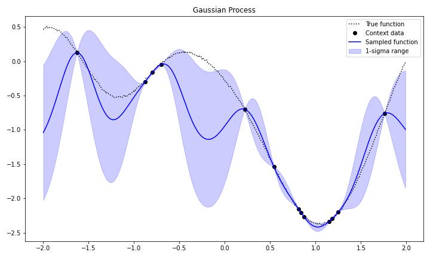
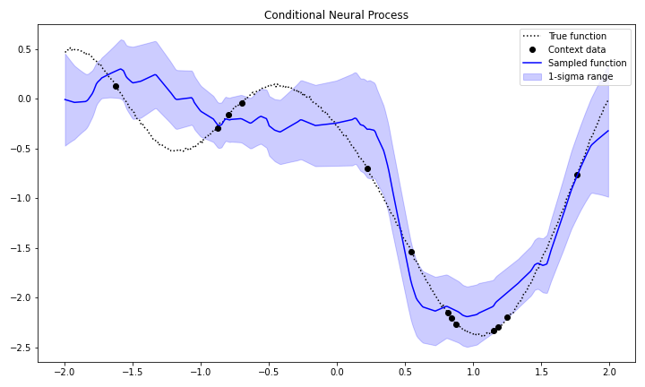
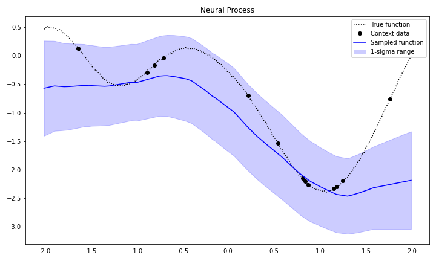
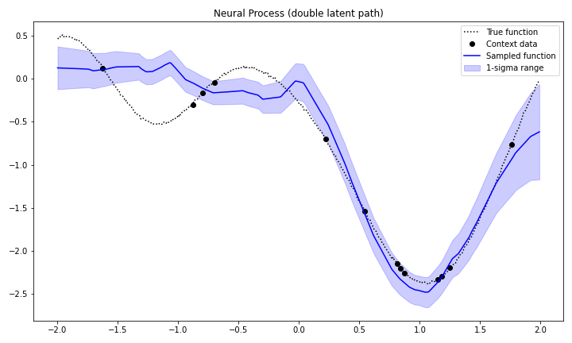

# Neural Process package

Neural Process family

# Requirements

* Python == 3.7
* PyTorch == 1.5.0

Requirements for example code

* matplotlib == 3.2.1
* tqdm == 4.46.0
* tensorboardX == 2.0

# How to use

## Set up environments

Clone repository.

```bash
git clone https://github.com/rnagumo/neuralprocess.git
cd neuralprocess
```

Install the package in virtual env.

```bash
python3 -m venv .venv
source .venv/bin/activate
pip3 install .

# Install other requirements for sample code.
pip3 install matplotlib==3.2.1 tqdm==4.46.0 tensorboardX==2.0
```

Or use [Docker](https://docs.docker.com/get-docker/).

```bash
docker build -t neuralprocess .
docker run -it neuralprocess bash
```

## Run experiment

Train models. Shell scripts in `bin` folder contains the necessary settings for building the environment.

```bash
# Usage
bash bin/train.sh <model-name>

# Example
bash bin/train.sh cnp
```

# Examples

## Training

```python
import torch
import neuralprocess as npr

# Dataset
loader = torch.utils.data.DataLoader(
    npr.GPDataset(train=True, batch_size=16), batch_size=1)

# Model
model = npr.ConditionalNP(x_dim=1, y_dim=1, r_dim=32)
optimizer = torch.optim.Adam(model.parameters())

# Train
for data in loader:
    loss_dict = model.loss_func(*data)
    loss = loss_dict["loss"].mean()
    loss.backward()
    optimizer.step()
```

## Test

```python
import torch
import neuralprocess as npr

# Dataset
loader = torch.utils.data.DataLoader(
    npr.GPDataset(train=False, batch_size=16), batch_size=1)

# Load pre-trained model
model = npr.ConditionalNP(x_dim=1, y_dim=1, r_dim=32)
cp = torch.load("./logs/cnp/checkpoint.pt")
model.load_state_dict(cp["model_state_dict"])

# Sample data
x_c, y_c, x_t, y_t = next(iter(loader))
y_mu, y_var = model.sample(x_c, y_c, x_t)

print(y_t.size(), y_mu.size(), y_var.size())
# -> torch.Size([1, 10, 1]) torch.Size([1, 10, 1]) torch.Size([1, 10, 1])
```

# Results

|model|results|
|:-:|:-:|
|Gaussian Process||
|Conditional Neural Process||
|Neural Process||
|Neural Process (double latent path)||
|Attentive Neural Process||
|Convolutional Conditional Neural Process||
|Sequential Neural Process||

# References

Original paper

* M. Garnelo *et al*., "Neural Processes" ([arXiv](http://arxiv.org/abs/1807.01622))
* M. Garnelo *et al*., "Conditional Neural Processes" ([arXiv](http://arxiv.org/abs/1807.01613))
* H, Kim *et al*., "Attentive Neural Processes" ([arXiv](http://arxiv.org/abs/1901.05761))
* J. Gordon *et al*., "Convolutional Conditional Neural Processes" ([arXiv](http://arxiv.org/abs/1910.13556))
* G. Singh *et al*., "Sequential Neural Processes" ([arXiv](http://arxiv.org/abs/1906.10264))

Sample code

* DeepMind "The Neural Process Family" ([GitHub](https://github.com/deepmind/neural-processes))
* cambridge-mlg "Convolutional Conditional Neural Processes" ([GitHub](https://github.com/cambridge-mlg/convcnp))
* singhgautam "Sequential Neural Processes" ([GitHub](https://github.com/singhgautam/snp))
